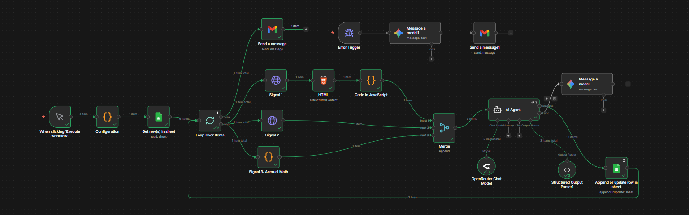

# 🤖 Self-Healing AI Financial Analyst (n8n)

An n8n workflow that turns a Google Sheets stock watchlist into AI-generated **Buy / Hedge / Avoid** recommendations — then emails you the report when done.

---

## How It Works

1. **Reads** your watchlist from Google Sheets
2. **Loops** over each ticker independently (no crashes if one fails)
3. **Analyzes** SEC 10-K filings, Yahoo Finance momentum, and custom accrual math
4. **AI Agent** synthesizes everything into a risk-scored JSON report
5. **Gemini Fail-Safe** auto-fixes any malformed AI output on the fly
6. **Writes** results back to Sheets and **emails** you the summary

---

## Setup

1. Import `workflow.json` into n8n
2. Add credentials: Google Sheets, Gmail, OpenRouter, Gemini
3. Point the config node at your Sheet ID
4. Hit **Execute** ✅

---

## Stack

`n8n` · `Google Sheets` · `Gmail` · `OpenRouter` · `Gemini` · `SEC EDGAR`
